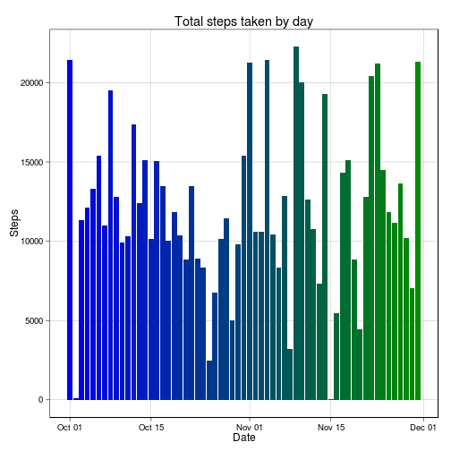

## Loading and preprocessing the data
<br/>
Begin by unzipping the data and reading the CSV contained within. We'll do this
in a single line:

```r
Action.Data <- read.csv(unzip('activity.zip')[1])
```
<br/>
Let's take a look at the data just to make sure it read in correctly and get an
idea as to what the data looks like:

```r
str(Action.Data)
```

```
## 'data.frame':	17568 obs. of  3 variables:
##  $ steps   : int  NA NA NA NA NA NA NA NA NA NA ...
##  $ date    : Factor w/ 61 levels "2012-10-01","2012-10-02",..: 1 1 1 1 1 1 1 1 1 1 ...
##  $ interval: int  0 5 10 15 20 25 30 35 40 45 ...
```
<br/>
Looks good! While we're at it, let's convert the *date* variable from factors
to actual Dates for later. We'll also format that *interval* variable so that it
can be parsed as a time, which will make it more meaningful when we plot the
data:

```r
Action.Data$date <- as.Date(Action.Data$date)

Action.Data$interval <- as.character(Action.Data$interval)
Action.Data$interval <- sapply(
  Action.Data$interval,
  function(x) {
    while(nchar(x) < 4)
      x <- paste0('0',x)
    x
  }
)
```
The result:

```r
Action.Data[sample(1:nrow(Action.Data),10),]
```

```
##       steps       date interval
## 17207     0 2012-11-29     1750
## 17457    NA 2012-11-30     1440
## 14534     0 2012-11-20     1105
## 3408      0 2012-10-12     1955
## 17236     0 2012-11-29     2015
## 444       0 2012-10-02     1255
## 17078     0 2012-11-29     0705
## 16223     0 2012-11-26     0750
## 5956      0 2012-10-21     1615
## 4330      0 2012-10-16     0045
```
***

## What is mean total number of steps taken per day?
<br/>
We'll start by summing up the total number of steps taken by date using the
*aggregate* function:

```r
stepsByDate <- aggregate(steps ~ date, Action.Data, sum)
head(stepsByDate)
```

```
##         date steps
## 1 2012-10-02   126
## 2 2012-10-03 11352
## 3 2012-10-04 12116
## 4 2012-10-05 13294
## 5 2012-10-06 15420
## 6 2012-10-07 11015
```
<br/>
Now let's make a histogram using ggplot2, along with the *colorRampPalette* to add
a little flair:

```r
library(ggplot2)
ggplot(stepsByDate, aes(date,steps)) +
  theme_linedraw() +
  labs(x    ='Date',
       y    ='Steps',
       title='Total steps taken by day'
  ) +
  geom_histogram(
    stat='identity',
    fill=colorRampPalette(c('blue2','green4'))(nrow(stepsByDate))
  )
```

 

</br>
Finally, while we're at it, we can use our aggregated data to compute the mean
and median of the number of steps by day:

```r
mean(stepsByDate$steps)
```

```
## [1] 10766.19
```

```r
median(stepsByDate$steps)
```

```
## [1] 10765
```

***

## What is the average daily activity pattern?
<br/>
Just like how we aggregated by date, we'll do something similar by interval,
finding the mean number of steps for each interval:

```r
Interval.Stats <- aggregate(steps ~ interval, Action.Data, mean)
colnames(Interval.Stats) <- c('Interval', 'Avg.Steps')
#Interval.Stats$Interval <- strptime(Interval.Stats$Interval,format='%H%M')

head(Interval.Stats)
```

```
##   Interval Avg.Steps
## 1     0000 1.7169811
## 2     0005 0.3396226
## 3     0010 0.1320755
## 4     0015 0.1509434
## 5     0020 0.0754717
## 6     0025 2.0943396
```
<br/>
Now, just like last time, use this new data frame to plot the average daily
activity pattern. We do this by making a time series plot of the 5-minute
interval and the average number of steps taken across all days:

```r
library(scales)
ggplot(Interval.Stats, aes(strptime(Interval.Stats$Interval, format="%H%M"),Avg.Steps)) +
  geom_line() +
  theme_linedraw() +
  labs(
    x    ='Time of day',
    y    ='Average number of steps',
    title='Average daily activity patterns'
  ) +
  scale_x_datetime(labels=function(x) format(x,"%R"))
```

 

<br/>
Looks like there's a clear spike at sometime around 8:00. We'll use
the *max* function to identify when exactly this occurs:

```r
Interval.Stats[which.max(Interval.Stats$Avg.Steps),'Interval']
```

```
## [1] "0835"
```

***

## Imputing missing values

</br>
How many rows of *Action.Data* are missing values (i.e., contain an 'NA')?

```r
sum(is.na(Action.Data$steps))
```

```
## [1] 2304
```
To fill these missing spaces, we'll generate random numbers based on the mean
and standard deviation of steps for the interval in which the NA exists. (This
is admittedly sort of overkill and was a personal choice, just to try something 
slightly more challenging. Statistically, I feel it's valid.)

<br/>
First thing will be to add an extra column to *Interval.Stats* that will contain
the standard deviation for that interval:

```r
Interval.Stats$Std.Dev <- aggregate(steps~interval,Action.Data,sd)$steps
head(Interval.Stats)
```

```
##   Interval Avg.Steps   Std.Dev
## 1     0000 1.7169811 7.9768351
## 2     0005 0.3396226 2.4724902
## 3     0010 0.1320755 0.9615239
## 4     0015 0.1509434 1.0988845
## 5     0020 0.0754717 0.5494423
## 6     0025 2.0943396 8.7557984
```
Next step will be to generate the vectors that will match mean and standard
deviation values to the missing data, based on the interval in which the
missing data lies:

```r
missingDataRows <- match(
  Action.Data[is.na(Action.Data),'interval'],
  Interval.Stats$Interval
)
meansVec <- Interval.Stats[missingDataRows,'Avg.Steps']
length(meansVec)
```

```
## [1] 2304
```

```r
sdVec    <- Interval.Stats[missingDataRows,'Std.Dev']
length(sdVec)
```

```
## [1] 2304
```
Finally, we used a couple nested *apply*-type calls to generate the numbers
and format them so they make sense in the data (see the comments):

```r
set.seed(1337)
Action.Data[is.na(Action.Data),'steps'] <- sapply(
  sapply(
    mapply(
      rnorm, # the function we want to call, rnorm
      rep(1, length(Action.Data[is.na(Action.Data)])), # 1 random number per call
      meansVec, # specify the mean for each iterative call of rnorm
      sdVec # specify the standard deviation for each call to rnorm
    ),
    abs # numbers generated from mapply should be positive (no negative steps)
  ),
  floor # round each number down to the nearest integer (whole steps)
)
```

</br>
With our new, complete dataset we'll once again take a look at a histogram
of total steps taken by date:

```r
stepsByDate <- aggregate(steps ~ date, Action.Data, sum)
ggplot(stepsByDate, aes(date,steps)) +
  labs(x='Date', y='Steps', title='Total steps taken by day') +
  theme_linedraw() +
  geom_histogram(
    stat='identity',
    fill=colorRampPalette(c('blue2','green4'))(nrow(stepsByDate))
  )
```

 

Notice that the days that had a lot of NA values (e.g., October 1) tend to go
up considerably than days with few or no missing values. Let's take a look and
see how and if this change to the data affects the mean and median numbers:

```r
mean(stepsByDate$steps)
```

```
## [1] 12085.05
```

```r
median(stepsByDate$steps)
```

```
## [1] 11458
```

***

## Are there differences in activity patterns between weekdays and weekends?

</br>
Finally, let's see how activity patterns differ between weekdays and weekends.
First, we'll start by adding a new row to *Action.Data* called *Day.Type*, which
classifies a record as to whether it was taken on a weekday or weekend. 

<br/>
To do this, begin by populating the new column with the actual days of the week
each record was taken:

```r
Action.Data$Day.Type <- weekdays(Action.Data$date)
set.seed(1337)
Action.Data[sample(1:nrow(Action.Data),10),]
```

```
##       steps       date interval Day.Type
## 10125     0 2012-11-05     0340   Monday
## 9921    189 2012-11-04     1040   Sunday
## 1300    345 2012-10-05     1215   Friday
## 7973      0 2012-10-28     1620   Sunday
## 6557      0 2012-10-23     1820  Tuesday
## 5819      0 2012-10-21     0450   Sunday
## 16643   123 2012-11-27     1850  Tuesday
## 4937      0 2012-10-18     0320 Thursday
## 4310     16 2012-10-15     2305   Monday
## 2565     14 2012-10-09     2140  Tuesday
```
Then, using some grep magic, we'll change the *Day.Type* into a broader 
classification based on the day of the week:

```r
Action.Data[grepl('(Saturday)|(Sunday)',Action.Data$Day.Type),'Day.Type'] <- 'Weekend'
Action.Data[grepl('[^(Weekend)]',Action.Data$Day.Type),'Day.Type'] <- 'Weekday'
set.seed(1337)
Action.Data[sample(1:nrow(Action.Data),10),]
```

```
##       steps       date interval Day.Type
## 10125     0 2012-11-05     0340  Weekday
## 9921    189 2012-11-04     1040  Weekend
## 1300    345 2012-10-05     1215  Weekday
## 7973      0 2012-10-28     1620  Weekend
## 6557      0 2012-10-23     1820  Weekday
## 5819      0 2012-10-21     0450  Weekend
## 16643   123 2012-11-27     1850  Weekday
## 4937      0 2012-10-18     0320  Weekday
## 4310     16 2012-10-15     2305  Weekday
## 2565     14 2012-10-09     2140  Weekday
```
Finally, we aggregate the data to take the mean number of steps based on both
the interval and day type the record was taken:

```r
Interval.Stats.New <- aggregate(steps~interval*Day.Type,Action.Data,mean)
head(Interval.Stats.New)
```

```
##   interval Day.Type     steps
## 1     0000  Weekday 2.5777778
## 2     0005  Weekday 0.8000000
## 3     0010  Weekday 0.1777778
## 4     0015  Weekday 0.2666667
## 5     0020  Weekday 0.1111111
## 6     0025  Weekday 2.3111111
```
And plot the result:

```r
ggplot(Interval.Stats.New, aes(strptime(Interval.Stats.New$interval,format='%H%M'),steps)) + 
  facet_grid(Day.Type~.) +
  geom_line() +
  theme_linedraw() +
  labs(
    x    ='Time of day',
    y    ='Average number steps',
    title='Average number of steps by time of day'
  ) +
  scale_x_datetime(labels=function(x) format(x,"%R"))
```

 
